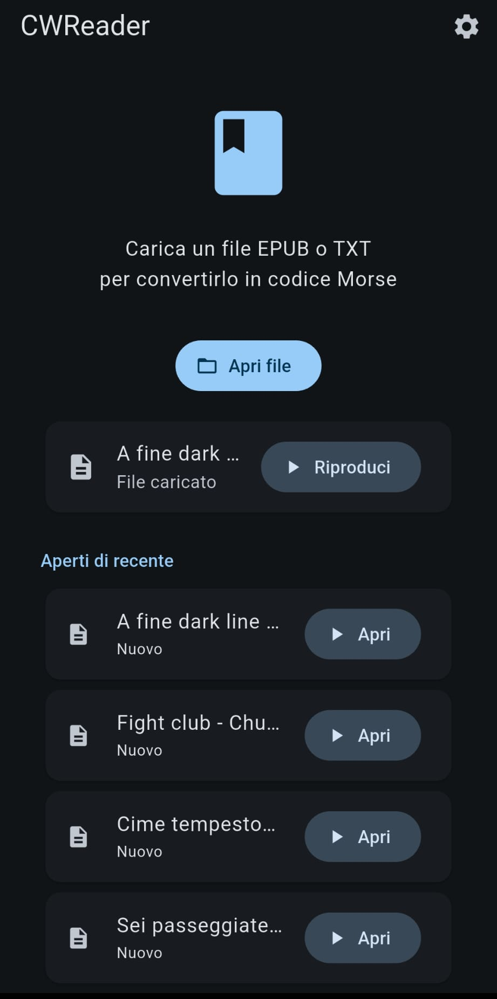
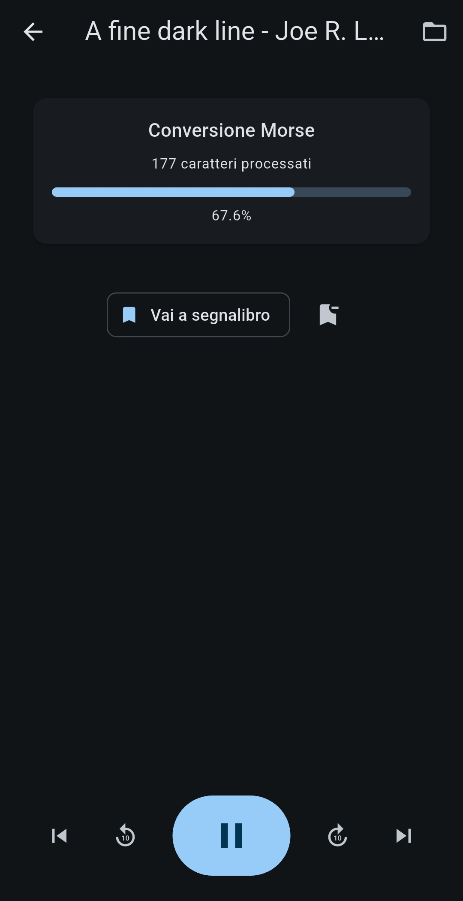
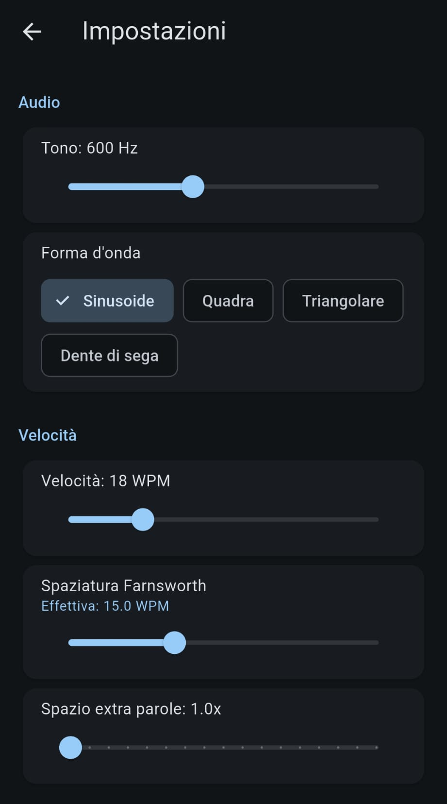
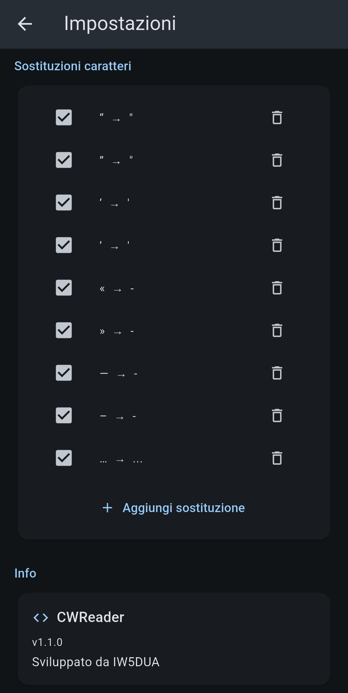

# CWReader

Convert EPUB/TXT ebooks to Morse code audio and play them back.

Read your favorite books as CW (Continuous Wave) Morse code — perfect for ham radio operators learning or practicing Morse code.

## Features

- **EPUB & TXT support** — Open ebooks or plain text files
- **Morse code audio** — Sine, square, triangle, or sawtooth waveform
- **Adjustable speed** — WPM, Farnsworth spacing, extra word spacing
- **Pitch control** — 400–900 Hz carrier frequency
- **Per-file progress** — Automatically saves last position for each file
- **Bookmarks** — Save and restore positions per file
- **Character substitutions** — Customizable replacements (e.g. quotes, special chars)
- **Italian accented characters** — à, è, é, ò, ù mapped to standard Italian Morse codes
- **Automatic encoding detection** — UTF-8, Latin-1, Windows-1252, UTF-16 BOM

## Download

[Download latest APK](../../releases/latest) CWReader-release.apk, move it on your Android device and install it. Grant the sandbox permissions to "install anyway".

## Screenshots

<table>
  <tr>
    <td align="center"> <em>Open file</em></td>
    <td align="center"> <em>Playback</em></td>
  </tr>
  <tr>
    <td align="center"> <em>Settings (1)</em></td>
    <td align="center"> <em>Settings (2)</em></td>
  </tr>
</table>

## License

GPLv3

## Credits

Developed by **IW5DUA**
